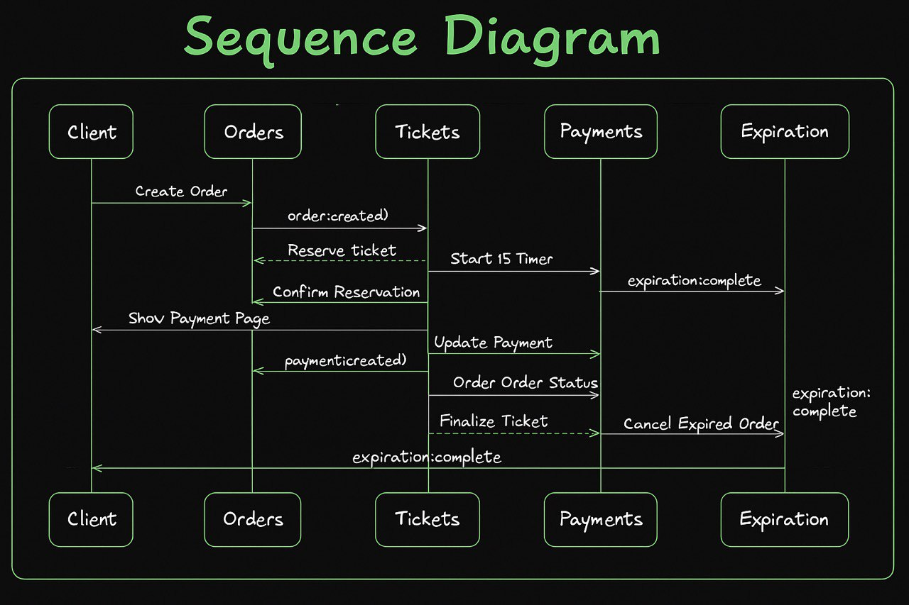
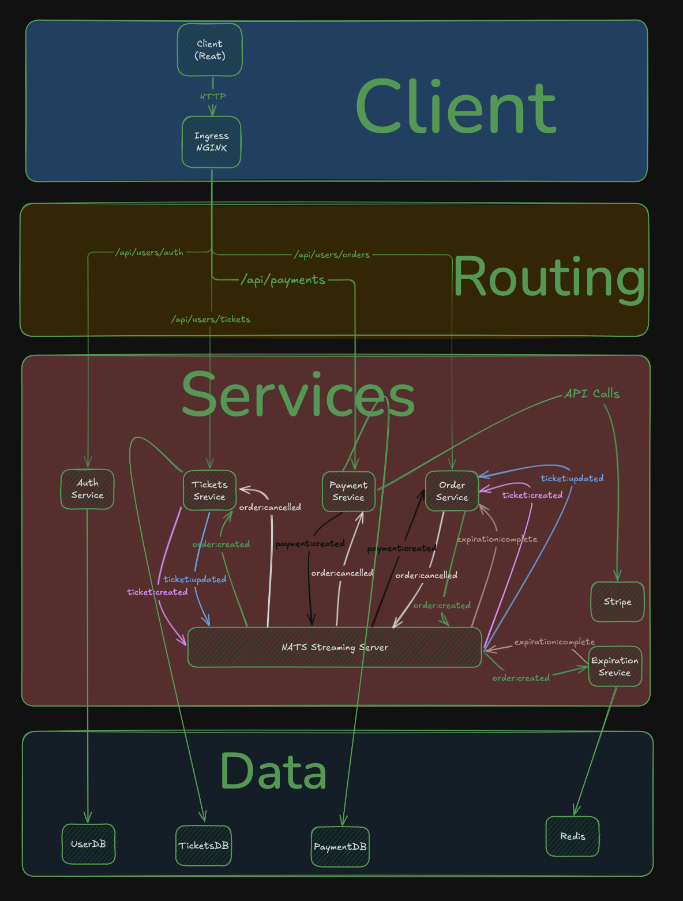

# 🎟️ Ticketing Microservices App

A full-featured ticketing system built as part of the [Microservices with Node.js and React](https://www.udemy.com/course/microservices-with-node-js-and-react/) Udemy course by Stephen Grider.

This project demonstrates the power of microservices using a containerized, event-driven architecture built with Node.js, Express, MongoDB, and React, with NATS Streaming and Kubernetes for deployment and service orchestration.

---

## 🔧 Features

- Microservice architecture with independent deployments
- User authentication and authorization (JWT-based)
- Ticket creation, reservation, and payment flows
- Order expiration and event-driven communication via NATS
- Stripe integration for real payments
- Responsive frontend built with React and Next.js
- Shared codebase via a custom NPM package (`common` service)
- Centralized error handling and request validation
- Dockerized with local Kubernetes support via Skaffold

---

## 🏗️ Microservices Architecture

Each service runs independently and communicates via NATS Streaming:

| Service     | Responsibility                       |
|-------------|----------------------------------------|
| `auth`      | Handles user registration and login   |
| `tickets`   | Ticket creation and management        |
| `orders`    | Order placement and status tracking   |
| `payments`  | Stripe integration and payment flow   |
| `expiration`| Auto-cancels expired orders           |
| `client`    | Frontend interface with React & Next  |
| `common`    | Shared codebase (middleware, errors)  |
| `infra`     | Kubernetes manifests and config files |

---

### 🔁 Sequence Diagram



---

### 🧱 Architecture Design



---

## 🧰 Tech Stack

### 🖥 Backend
- Node.js, Express
- MongoDB, Mongoose
- JWT (JSON Web Tokens)
- NATS Streaming
- Stripe API
- Jest, Supertest

### 🌐 Frontend
- React.js (Next.js)
- Axios
- Tailwind CSS (or custom styling)
- React Hooks

### 🐳 DevOps
- Docker
- Kubernetes
- Skaffold
- Ingress NGINX

---

## 📁 Folder Structure

```
ticketing/
├── auth/           # Authentication service
├── client/         # React + Next.js frontend
├── common/         # Shared code between services
├── expiration/     # Background service to expire orders
├── infra/          # Kubernetes config files
├── nats-test/      # Utility publisher to test NATS
├── orders/         # Handles ticket ordering logic
├── payments/       # Stripe payment integration
├── tickets/        # Ticket CRUD operations
├── skaffold.yaml   # Skaffold config for local K8s dev
└── README.md       # You're reading it!
```

---

## 🚀 Getting Started

### ✅ Prerequisites

- Docker
- Kubernetes (Docker Desktop with Kubernetes enabled OR minikube)
- Skaffold (`brew install skaffold`)
- [Stripe](https://stripe.com) account and test API key

### 🔧 Setup

1. Clone the repository:

```bash
git clone https://github.com/ahmedbahy2026/ticketing.git
cd ticketing
```

2. Update your `/etc/hosts` file:

```
127.0.0.1 ticketing.dev
```

3. Install and configure Ingress NGINX:

```bash
kubectl apply -f https://raw.githubusercontent.com/kubernetes/ingress-nginx/controller-v1.2.1/deploy/static/provider/cloud/deploy.yaml
```

4. Start the app using Skaffold:

```bash
skaffold dev
```

> The app will be available at: [http://ticketing.dev](http://ticketing.dev)

---

## 🔐 Environment Variables

Each service contains its own `.env` or Kubernetes secrets for configuration.

Typical required environment variables:

- `JWT_KEY`
- `MONGO_URI`
- `NATS_CLIENT_ID`
- `NATS_URL`
- `NATS_CLUSTER_ID`
- `STRIPE_KEY`

You can use Kubernetes secrets to provide them.

---

## 🧪 Running Tests

Each service is self-contained and testable using:

```bash
# Inside each service folder
npm install
npm test
```

Example:

```bash
cd auth
npm test
```

---

## 📦 Common Module

The `common` folder contains shared logic between all services:
- Custom error classes
- Express middleware
- Request validation helpers
- Authentication logic

It is built and published to a private NPM registry (or local symlink) for reuse across services.

---

## 📮 API Endpoints (Sample)

| Method | Endpoint               | Service | Description             |
|--------|------------------------|---------|-------------------------|
| POST   | `/api/users/signup`    | Auth    | Register new user       |
| POST   | `/api/users/signin`    | Auth    | Login                   |
| POST   | `/api/tickets`         | Tickets | Create new ticket       |
| PUT    | `/api/tickets/:id`     | Tickets | Update ticket           |
| POST   | `/api/orders`          | Orders  | Create an order         |
| POST   | `/api/payments`        | Payments| Make payment via Stripe |

---

## 📜 License

This project is licensed under the MIT License.

---

## 🙋‍♂️ Acknowledgements

This project is built while following [Stephen Grider](https://github.com/stephengrider)'s **Microservices with Node.js and React** Udemy course. Enhancements and contributions made by [Ahmed Bahy](https://github.com/ahmedbahy2026).

---

## 📬 Contact

- GitHub: [ahmedbahy2026](https://github.com/ahmedbahy2026)
- Project Link: [https://github.com/ahmedbahy2026/ticketing](https://github.com/ahmedbahy2026/ticketing)